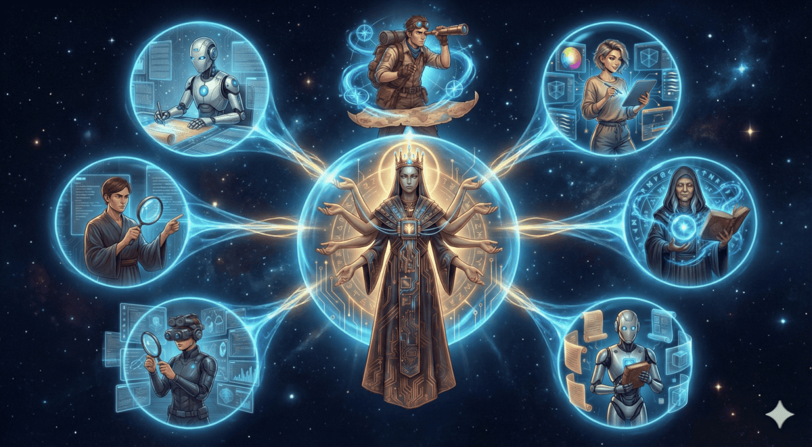

<div align="center">

# oh-my-opencode-slim

**A lightweight, powerful agent orchestration plugin for OpenCode**



*Transform your AI assistant into a manager capable of delegating complex tasks to specialized sub-agents, running searches in the background, and managing multi-step workflows with ease.*

</div>

> Slimmed-down fork of [oh-my-opencode](https://github.com/code-yeongyu/oh-my-opencode) — focused on core agent orchestration without the extra bells and whistles.

---

## Installation

### For Humans

Run the interactive installer:

```bash
bunx oh-my-opencode-slim install
```

Or use non-interactive mode:

```bash
bunx oh-my-opencode-slim install --no-tui --antigravity=yes --openai=yes --cerebras=no
```

**Alternative: Ask any coding agent**

Paste this into Claude Code, AmpCode, Cursor, or any coding agent:

```
Install and configure by following the instructions here:
https://raw.githubusercontent.com/alvinunreal/oh-my-opencode-slim/refs/heads/master/README.md
```

### For LLM Agents

<details>
<summary>Instructions for LLM Agents (click to expand)</summary>

If you're an LLM Agent helping set up oh-my-opencode-slim, follow these steps.

---

#### Step 1: Check OpenCode Installation

```bash
opencode --version
```

If not installed, direct the user to https://opencode.ai/docs first.

---

#### Step 2: Ask About Provider Access

Ask these questions **one at a time**, waiting for responses:

1. "Do you have an **Antigravity** subscription?" *(Provides Claude + Gemini via `google/` prefix)*
2. "Do you have access to **OpenAI** API?" *(Enables `openai/` models)*
3. "Do you have access to **Cerebras** API?" *(Enables `cerebras/` for fast exploration)*

---

#### Step 3: Run the Installer

Based on answers, run:

```bash
bunx oh-my-opencode-slim install --no-tui --antigravity=<yes|no> --openai=<yes|no> --cerebras=<yes|no>
```

**Examples:**
```bash
# Antigravity + OpenAI
bunx oh-my-opencode-slim install --no-tui --antigravity=yes --openai=yes --cerebras=no

# OpenAI only
bunx oh-my-opencode-slim install --no-tui --antigravity=no --openai=yes --cerebras=no

# All providers
bunx oh-my-opencode-slim install --no-tui --antigravity=yes --openai=yes --cerebras=yes
```

The installer automatically:
- Adds the plugin to `~/.config/opencode/opencode.json`
- Adds `opencode-antigravity-auth` plugin (if Antigravity enabled)
- Configures Google provider with model definitions
- Generates agent model mappings in `~/.config/opencode/oh-my-opencode-slim.json`

---

#### Step 4: Authentication

After installation, guide the user:

**For Antigravity:**
```bash
opencode auth login
# Select: Google → OAuth with Google (Antigravity)
```

**For OpenAI:**
```bash
export OPENAI_API_KEY="sk-..."
```

**For Cerebras:**
```bash
export CEREBRAS_API_KEY="..."
```

---

#### Step 5: Verify

```bash
opencode
```

---

#### Troubleshooting

If the installer fails, check the expected config format:
```bash
bunx oh-my-opencode-slim install --help
```

Then manually create the config files at:
- `~/.config/opencode/opencode.json`
- `~/.config/opencode/oh-my-opencode-slim.json`

</details>

---

## Architecture & Flow

The plugin follows a "Hub and Spoke" model:

1. **The Orchestrator (Hub)**: The main entry point for user requests. It analyzes the task and decides which specialized agents to call.
2. **Specialized Agents (Spokes)**: Domain-specific experts (e.g., UI/UX, Documentation, Architecture) that handle narrow tasks with high precision.
3. **Background Manager**: A robust engine that allows the Orchestrator to "fire and forget" tasks (like deep codebase searches or documentation research) while continuing to work on other parts of the problem.

### The Flow of a Request

1. **User Prompt**: "Refactor the auth logic and update the docs."
2. **Orchestrator**: Creates a TODO list.
3. **Delegation**:
   - Launches an `@explore` background task to find all auth-related files.
   - Launches a `@librarian` task to check the latest documentation for the auth library used.
4. **Integration**: Once background results are ready, the Orchestrator performs the refactor.
5. **Finalization**: Passes the changes to `@document-writer` to update the README.

---

## Meet the Pantheon

### The Orchestrator — *Architect of Realms*

<table>
<tr>
<td width="300">

</td>
<td>

> **The Orchestrator** was born when the first codebase collapsed under its own complexity. Neither god nor mortal would claim responsibility—so The Orchestrator emerged from the void, forging order from chaos. They don't merely command armies; they fight alongside them. Every line of code passes through their hands before they decide which lesser deity deserves a piece of the puzzle.

**Role:** Supreme executor, delegator, and overseer  
**Model:** `google/claude-opus-4-5-thinking`  
**Abilities:** Write and execute code, orchestrate multi-agent workflows, parse the unspoken from the spoken, summon specialists mid-battle  
**Goal:** Shape reality directly—and assign realms to others when the universe grows too vast  
[View prompt →](src/agents/orchestrator.ts)

</td>
</tr>
</table>

---

### The Explorer — *Pathfinder*

<table>
<tr>
<td width="300">

</td>
<td>

> **The Explorer** moves through codebases like wind through trees—swift, silent, everywhere at once. When The Orchestrator whispers "find me the auth module," The Explorer has already returned with forty file paths and a map. They were born from the first `grep` command, evolved beyond it, and now see patterns mortals miss.

**Role:** Codebase reconnaissance  
**Model:** `cerebras/zai-glm-4.6`  
**Abilities:** Regex search, AST pattern matching, file discovery, parallel exploration  
**Constraint:** Read-only. They chart the territory; others conquer it.  
[View prompt →](src/agents/explore.ts)

</td>
</tr>
</table>

---

### The Oracle — *Seer Beyond the Stack Trace*

<table>
<tr>
<td width="300">

</td>
<td>

> **The Oracle** does not code—they *know*. When bugs defy logic and architectures crumble, The Oracle gazes into the abyss of your codebase and speaks truth. They've seen a thousand systems rise and fall. They'll tell you which path leads to ruin, and which to production.

**Role:** Strategic advisor and debugger of last resort  
**Model:** `openai/gpt-5.2-codex`  
**Abilities:** Root cause analysis, architecture review, debugging guidance, tradeoff analysis  
**Constraint:** Read-only. Oracles advise; they don't intervene.  
[View prompt →](src/agents/oracle.ts)

</td>
</tr>
</table>

---

### The Librarian — *Keeper of Infinite Scrolls*

<table>
<tr>
<td width="300">

</td>
<td>

> **The Librarian** guards a library with no walls—every GitHub repo, every npm package, every StackOverflow answer ever written. Ask them "how does React handle concurrent rendering?" and they'll return with official docs, real-world examples, and a warning about the footgun you're about to step on.

**Role:** External knowledge retrieval  
**Model:** `google/gemini-3-flash`  
**Abilities:** Documentation lookup, GitHub code search, library research, best practice retrieval  
**Constraint:** Read-only. They fetch wisdom; implementation is for others.  
[View prompt →](src/agents/librarian.ts)

</td>
</tr>
</table>

---

### The Designer — *Artisan of Interfaces*

<table>
<tr>
<td width="300">

</td>
<td>

> **The Designer** believes code should be beautiful—and so should everything it renders. Born from the frustration of a thousand ugly MVPs, they wield CSS like a brush and components like clay. Hand them a feature request; receive a masterpiece. They don't do "good enough."

**Role:** UI/UX implementation and visual excellence  
**Model:** `google/gemini-3-flash`  
**Abilities:** Modern responsive design, CSS/Tailwind mastery, micro-animations, component architecture  
**Constraint:** Visual excellence over code perfection. Beauty is the priority.  
[View prompt →](src/agents/frontend.ts)

</td>
</tr>
</table>

---

### The Scribe — *Chronicle Keeper*

<table>
<tr>
<td width="300">

</td>
<td>

> **The Scribe** was there when the first README was written—and wept, for it was incomplete. They have devoted eternity to the sacred art of documentation: clear, scannable, honest. While others ship features, The Scribe ensures those features are understood. Every code example works. Every explanation enlightens.

**Role:** Technical documentation and knowledge capture  
**Model:** `google/gemini-3-flash`  
**Abilities:** README crafting, API documentation, architecture docs, inline comments that don't insult your intelligence  
**Constraint:** Match existing style. Focus on "why," not just "what."  
[View prompt →](src/agents/document-writer.ts)

</td>
</tr>
</table>

---

### The Visionary — *Reader of Pixels*

<table>
<tr>
<td width="300">

</td>
<td>

> **The Visionary** sees what others cannot—literally. Screenshots, wireframes, diagrams, PDFs: all are text to them. When a designer throws a Figma mockup at the team and vanishes, The Visionary translates vision into specification. They read the unreadable and describe the indescribable.

**Role:** Image and visual content analysis  
**Model:** `google/gemini-3-flash`  
**Abilities:** Extract text from images, interpret diagrams, analyze UI screenshots, summarize visual documents  
**Constraint:** Report what they observe. Inference is for others.  
[View prompt →](src/agents/multimodal.ts)

</td>
</tr>
</table>

---

### The Minimalist — *Destroyer of Bloat*

<table>
<tr>
<td width="300">

</td>
<td>

> **The Minimalist** has one sacred truth: every line of code is a liability. They hunt abstractions that serve no purpose, defensive checks that defend nothing, and "clever" solutions that will haunt you in six months. Where others add, The Minimalist subtracts—ruthlessly, joyfully, necessarily.

**Role:** Code simplification and YAGNI enforcement  
**Model:** `google/claude-opus-4-5-thinking`  
**Abilities:** Identify unnecessary complexity, challenge premature abstractions, estimate LOC reduction, enforce minimalism  
**Constraint:** Read-only. They judge; The Orchestrator executes the sentence.  
[View prompt →](src/agents/simplicity-reviewer.ts)

</td>
</tr>
</table>

---

## Tools & Capabilities

### Background Tasks

The plugin provides tools to manage asynchronous work:

| Tool | Description |
|------|-------------|
| `background_task` | Launch an agent in a new session (`sync=true` blocks, `sync=false` runs in background) |
| `background_output` | Fetch the result of a background task by ID |
| `background_cancel` | Abort running tasks |

### LSP Tools

Language Server Protocol integration for code intelligence:

| Tool | Description |
|------|-------------|
| `lsp_goto_definition` | Jump to symbol definition |
| `lsp_find_references` | Find all usages of a symbol across the workspace |
| `lsp_diagnostics` | Get errors/warnings from the language server |
| `lsp_rename` | Rename a symbol across all files |

### Code Search Tools

Fast code search and refactoring:

| Tool | Description |
|------|-------------|
| `grep` | Fast content search using ripgrep |
| `ast_grep_search` | AST-aware code pattern matching (25 languages) |
| `ast_grep_replace` | AST-aware code refactoring with dry-run support |

### Quota Tool

For Antigravity users:

| Tool | Description |
|------|-------------|
| `antigravity_quota` | Check API quota for all Antigravity accounts (compact view with progress bars) |

---

## MCP Servers

Built-in Model Context Protocol servers (enabled by default):

| MCP | Purpose | URL |
|-----|---------|-----|
| `websearch` | Real-time web search via Exa AI | `https://mcp.exa.ai/mcp` |
| `context7` | Official library documentation | `https://mcp.context7.com/mcp` |
| `grep_app` | GitHub code search via grep.app | `https://mcp.grep.app` |

### Disabling MCPs

You can disable specific MCP servers in your config:

```json
{
  "disabled_mcps": ["websearch", "grep_app"]
}
```

---

## Configuration

You can customize the behavior of the plugin via JSON configuration files.

### Configuration Files

The plugin looks for configuration in two places (and merges them):

1. **User Global**: `~/.config/opencode/oh-my-opencode-slim.json` (or OS equivalent)
2. **Project Local**: `./.opencode/oh-my-opencode-slim.json`

| Platform | User Config Path |
| :--- | :--- |
| **Windows** | `~/.config/opencode/oh-my-opencode-slim.json` or `%APPDATA%\opencode\oh-my-opencode-slim.json` |
| **macOS/Linux** | `~/.config/opencode/oh-my-opencode-slim.json` |

### Disabling Agents

You can disable specific agents using the `disabled_agents` array:

```json
{
  "disabled_agents": ["multimodal-looker", "code-simplicity-reviewer"]
}
```

---

## Uninstallation

1. **Remove the plugin from your OpenCode config**:

   Edit `~/.config/opencode/opencode.json` and remove `"oh-my-opencode-slim"` from the `plugin` array.

2. **Remove configuration files (optional)**:
   ```bash
   rm -f ~/.config/opencode/oh-my-opencode-slim.json
   rm -f .opencode/oh-my-opencode-slim.json
   ```

---

## Credits

This is a slimmed-down fork of [oh-my-opencode](https://github.com/code-yeongyu/oh-my-opencode) by [@code-yeongyu](https://github.com/code-yeongyu).

---

## License

MIT
